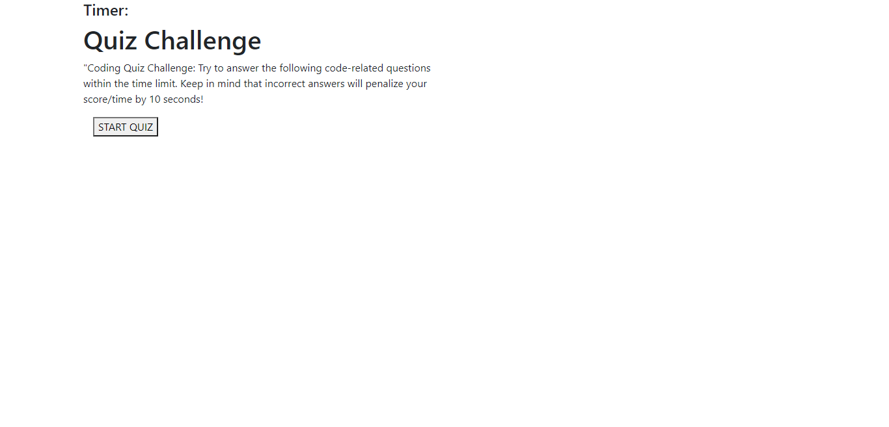

# homework04_code_quiz# 

## Description

This quiz was created to test the users knowledge of javascript and html
This quiz will keep track of your score as you move through the quiz

## Installation

## Usage

## Technologies Used

GitHub / StackoverFlow / Study Group 

## Problems I faced

I had issues with getting the questions to move on to the next
Issues with the time not stopping once the quiz ended
All have been fixed

## Credits

Amazing Tutor 

## Image

## Links
[link to GitHub!](https://github.com/ryanwit/homework04_code_quiz)

[link to Webpage!](https://ryanwit.github.io/homework04_code_quiz//)

# License